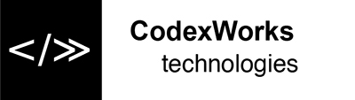

  <!-- alignment is optional and not recommended -->
  ">

# Wellcome
> Wellcome to the Autonomous Fleet Project, **afm** for short. We are always happy to meet new people who want to contribute or show an interest in our project.

This is a set of guidelines for new contributors, aimed at helping them with the first steps of the process, and outlining some general recommendations.

This document being in its first version, we wellcome any input. If you feel that some parts/chapters/processes are unclear or missing, please contact us at george.monda@codexworks.com or office@codexworks.com, so that we can improve it.

# How to setup the environment
**_coming soon_**
 This will be descried in the README.md file.

# Where to find Tasks
**_coming soon_**
 For bugs and problems, the GitHub Issues will be used.
 For features, stories and tasks, we are currently looking into free tools for project and team management that are integrated with GitHub.

# How to submit a change
- Go to the repository at https://github.com/CodexWorks/autonomous-fleet
- Fork a new branch from **dev** branch. Naming conventions:
  - `feat-<feature_name>` for new features
  - `task-<task_name>` for tasks unrelated to features or coding
- Once you finished work your branch, create a **Pull Request** to merge it into **dev**
  - merging will require at least one reviewer to approve it. Code owners will be assigned automatically as reviewers, otherwise you can manually choose a reviewer.

# Code Review Process
When you create a Pull Request and select the target branch to merge it into, you will get the option to add a comment and on the right, to assign a Reviewer. 

If the parent branch had code owners, this might get filled automatically with the code owners, otherwise select one from the list. All merges into **dev** and **master** require at least 1 code review. 

Then you can create the Pull Request, and will see that the merge is blocked by the review.

 
The reviewer will be notified via mail. Will start the review and comment on your code. You can both see the comments.

The reviewer will either approve or request changes to the code in which case you have to implement those changes and commit them to the branch. Any commits after the pull request is created will be part of that pull request until the review is closed, so you can go back and forth with the reviewer on comments and changes.

Once the reviewer approves, you will be notified via email. Then you can merge the pull request, add a final comment and confirm the merge. 

After the merge, you can delete your branch.

# How to report a Bug
Bugs are tracked with the GitHub Issues. A guide on how to use it can be found [here](https://guides.github.com/features/issues/).
 One you find a problem and want to report it, fill in the **Bug Report Template** describer below, making sure that all the prerequisites are met.

## Bug Report Template
### **Prerequisites Checklist**
Check each item on the list that you have gone through, with a checkmark symbol **✓**.
- **✓** made sure that the problem can be reproduced
- debugged the problem locally
- **✓** checked the repository for any branches addressing this problem.
- checked the pull Requests, Issues, Team Discussions if the problem has been encountered and addressed before.

### **Steps to reproduce**
- 
- 
- 

How often does it happen? 
 Often / 80% of the time / Sometimes / A few times / etc.

### **Expected Behavior**
### **Actual Behavior**
### **Additional Information**
### **Attachments**
Logs, pictures, refenreces, links, any additional resource that might help.

# How to suggest a feature/enhancement
Enhancements are tracked with the GitHub Issues, just like bugs. For details on how to use the functionality, please see the previous chapter on how to report bugs.

In order to properly suggest a feature or enhancement, follow the template below.

## Feature Report Template
### **Prerequisites Checklist**
Check each item on the list that you have gone through, with a checkmark symbol **✓**.
- **✓** checked the repository for any branches with a similar feature.
- checked the pull Requests, Issues, Team Discussions if a similar feature has been encountered and addressed before.
### **Summary**
### **Motivation and Context**
### **Possible alternatives**
### **Attachments**
Pictures, refenreces, links, any additional resource that might help people understand the feature/enhancement.

# Style Guide and Conventions
## Branching model
At the moment we are using a simplified version of the [Git branching model](https://nvie.com/posts/a-successful-git-branching-model/). 
 The only difference is that we don't use release branches. The main flow is from **feature branches** to **dev** and there to **master**.

For code style and formatting, we follow the popular coding styleguides for each specific language. We haven't set any strict rules here. Any issues remaining to be clarified in the review process.

# Communication
At the moment we have the following channels for communication: 
- Issues - for opening and discussions on issues
- Pull Requests - for opening and discussions on code changes and merges
- Team discussions - for team members to discuss various subjects on the project
  - [@authors](https://github.com/orgs/CodexWorks/teams/authors)
  - [@contributors](https://github.com/orgs/CodexWorks/teams/contributors)
- Slack - for core team members to discuss issues in a more private manner

# Persons involved
- George Monda - george.monda@codexworks.com
- Izabella Varga - izabella.varga@codexworks.com
- Florentin Bota - florentin.bota@codexworks.com

